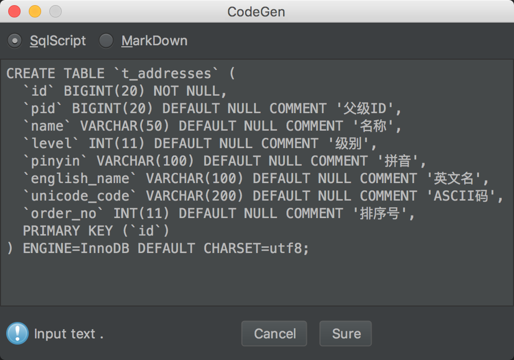
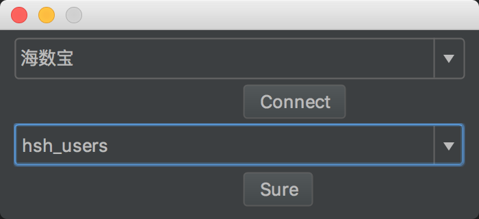
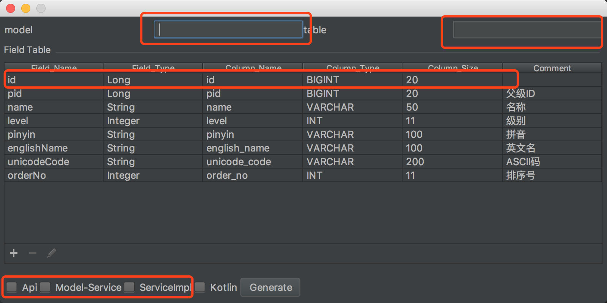

# CodeGen 使用手册

## 安装

`Preferences -> Plugins -> Browse repositories -> [search] CodeGen`

## 配置

`Preferences -> Tools -> CodeGen` OR `command + , ->Codegen` 

### 生成方式

codegen 支持两种生成方式：
(1) **SQL**，解析建表Sql获取字段列表
(2) **数据库**，直接连接查询字段列表


### 内置参数

codegen 目前内置了部分**时间参数**，以及**序列化ID**、**project名称**、选择的**Module名称**、选择的**package名称**。

```
{{$.Year}} current year

{{$.Month}} current month

{{$.Day}} current day of the month

{{$.Hour}} current hour

{{$.Minute}} current minute

{{$.Second}} current second

{{$.Date}} current system date

{{$.Now}} current system time

{{$.serialVersionUID}} current model serialVersionUID

{{$.Project}} the name of the current project

{{$.Module1} the name of the current selected module

{{$.Package1} the name of the current selected package
```

### 内置Helper

codegen 使用**handlebars.java模板引擎**进行生成，支持使用**原生的helper**。
同时内置以下helpers，如果其他有需求欢迎提出。

```
- 首尾拼接字符
{{Join 'ABC' '#' '%'}}  => #ABC%

- 首字母小写
{{LowerCase 'ABC'}} => aBC

- 首字母大写
{{UpperCase 'abc'}} => Abc

- 驼峰分割
{{Split 'ABcD' '_'}} => A_bc_d

* 组合用法
{{Split (Join (LowerCase 'AbcDefGhi') '$' '%') '_'}} => $abc_def_ghi%
```

###  自定义参数

codegen  支持自定义参数，模版内调用方式为  `{{$.参数名称}}`，如 ：`{{$.mobile}}`


### 自定义模板组

codegen 设置模板组的目的，在于方便在项目不同的module中生成模版。
目前内置了java和kotlin两套模板，可对模版进行修改，如果有其他模板欢迎提供。


### 数据源管理

codegen 在使用数据库方式生成代码时，需要先**配置数据源**，目前只支持**Mysql**数据库。


## 使用

`shift + command + g` OR `Tools -> CodeGen`

### SQL生成方式

当使用SQL生成方式时，将建表Sql复制到输入框；


### 数据库生成方式

当使用数据库生成方式时，必须**先配置数据源**。
选择正确的数据源，点解**connect**获取所有的表列表。
选择需要生成代码的表，点击**sure**获取字段列表。



### 编辑字段列表

选择合适的生成方式以后，获取到字段列表。
补全**model**名称和**table**名称。
~~使用内置模版时，因为已将字段 `id`, `created_at`, `updated_at`固定在模板中，所以生成代码时，需要先**删除**该字段。~~
可在配置中，对模版固定字段进行忽略。
勾选需要生成的模版组，点解**Generate**，进行代码生成。



### 选择代码生成目录

codegen 目前**只支持选择package** 即 `src/main/java`以下的目录为生成目录，选择其他目录时将会弹窗提示错误。
若生成代码时，勾选了三个模板组，此时需要**选择**三次目录。


**代码生成结束**。