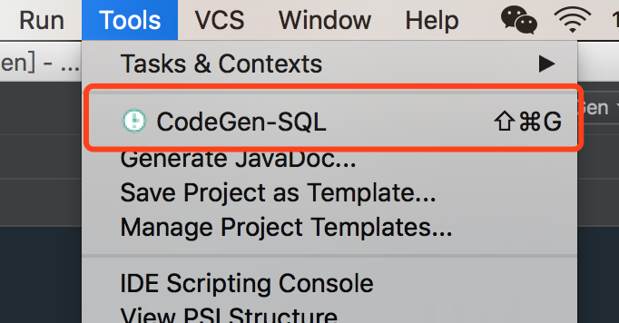
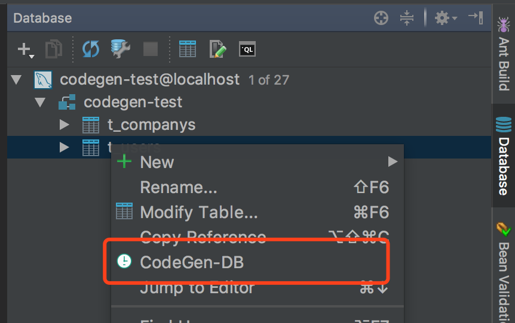
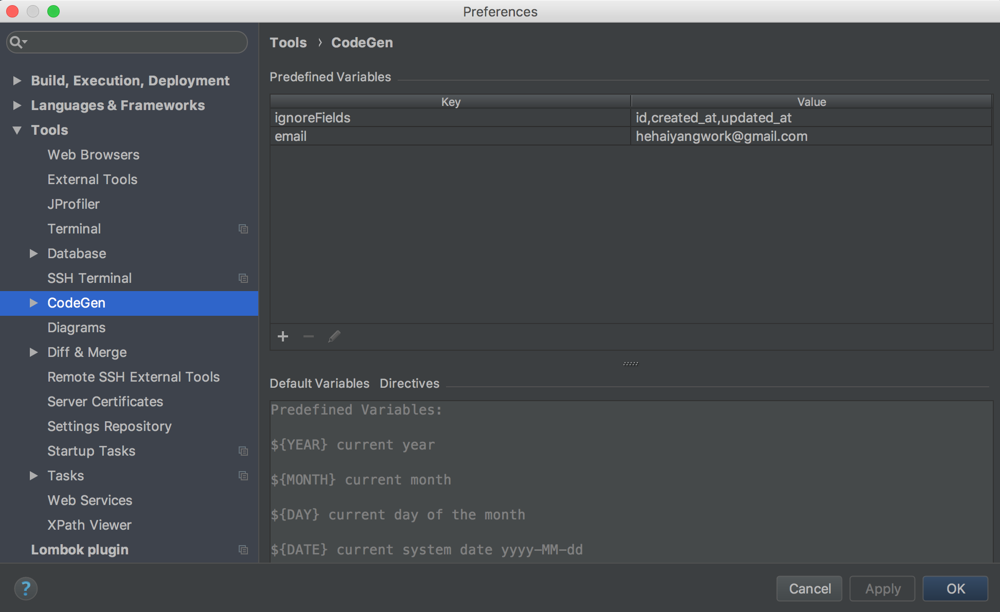
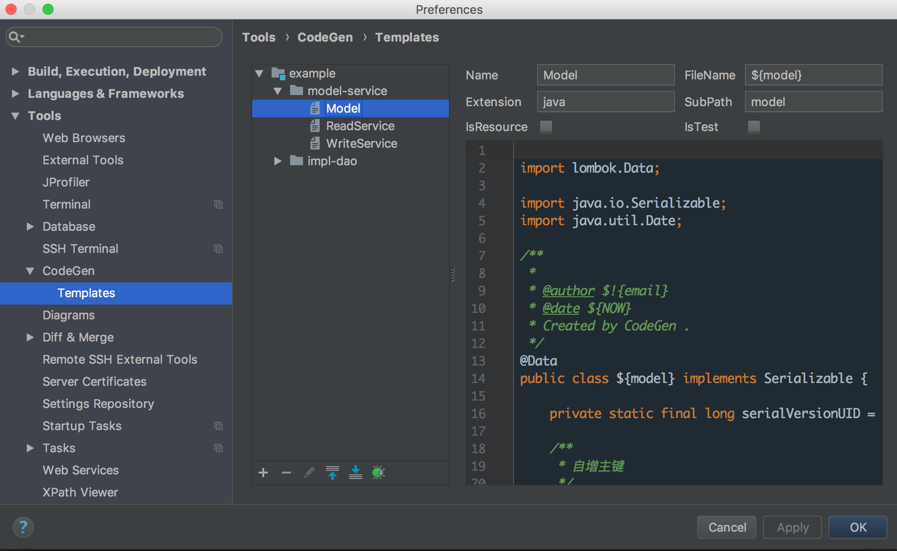
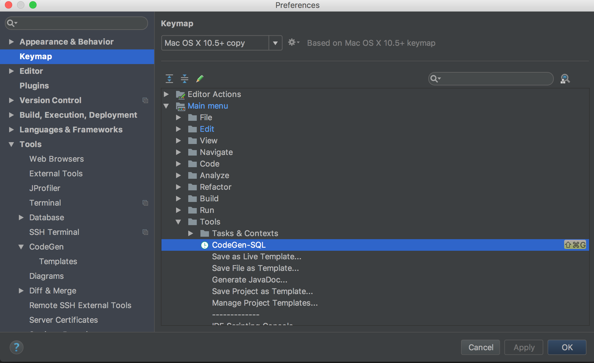
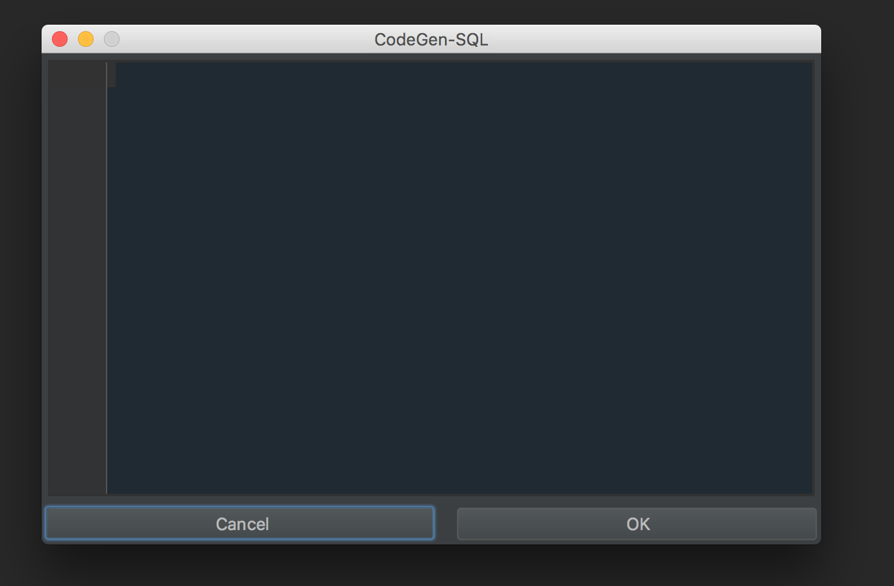
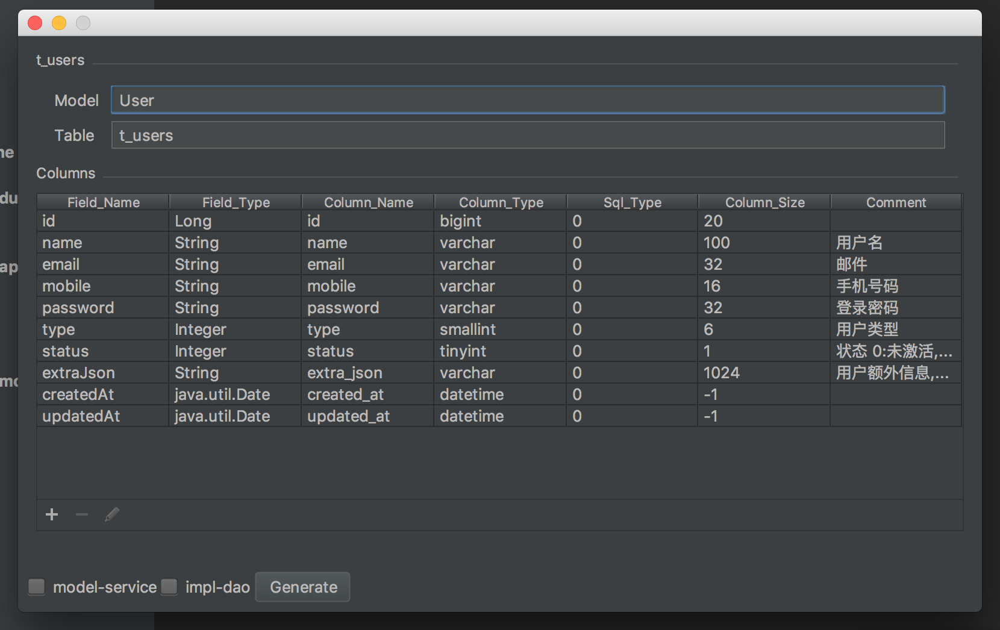
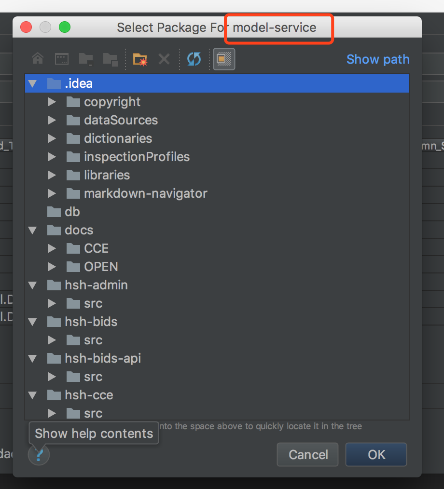

# CodeGen v1.2 使用手册

## 安装

`Preferences -> Plugins -> Browse repositories -> [search] CodeGen`

## 配置

`Preferences -> Tools -> CodeGen` OR `command + , ->Codegen` 

### 生成方式

codegen 支持两种生成方式：
(1) **SQL**，解析建表Sql获取字段列表



(2) **数据库**，直接连接查询字段列表


### 内置参数

codegen 目前内置了部分**时间参数**，以及**序列化ID**、**project名称**。

```
${YEAR} current year

${MONTH} current month

${DAY} current day of the month

${DATE} current system date yyyy-MM-dd

${TIME} current system time HH:mm:ss

${NOW} current system time yyyy-MM-dd HH:mm:ss

${USER} current system user name

${serialVersionUID} current file serialVersionUID

${Project} the name of the current project
```

### 内置指令

codegen 使用**Volecity模板引擎**进行生成，支持使用**原生的指令**。
同时内置以下指令，如果其他有需求欢迎提出。

```
* 首尾拼接
#Append('ABC' '#' '%')  => #ABC%

* 首字母小写
#LowerCase('ABC') => aBC

* 首字母大写
#UpperCase('abc') => Abc

* 驼峰分割
#Split('ABcD' '_') => A_bc_d

* 组合用法
#Append("#LowerCase('AbcDefGhi')" '$' '%') => $abcDefGhi%
```

### 自定义参数

codegen  支持自定义参数，模版内调用方式为  `$!{参数名称}`，如 ：`$!{email}`



### 自定义模板组

codegen 设置模板组的目的，在于方便在项目不同的module中生成模版。



### 数据源管理

新版 CodeGen ,直接调用 database tool 管理数据源。

### 快捷键设置



## 使用

`shift + command + g` OR `Tools -> CodeGen`

### SQL生成方式

当使用SQL生成方式时，将建表语句复制到输入框，点击 OK 。


### 数据库生成方式

当使用数据库生成方式时，必须**先配置 database 数据源**。
选择需要生成代码的表，支持多选，
右击，选择 CodeGen-DB。

### 编辑字段列表

选择合适的生成方式以后，获取到字段列表。
修改**model**名称和**table**名称。
如果需要对字段进行忽略，如 `id`、`created_at`、`updated_at`等，可以在添加自定义参数 ignoreFields 。
勾选需要生成的模版组，点解**Generate**，进行代码生成。



### 选择代码生成目录

codegen 目前**只支持选择package** 即 `src/main/java`以下的目录为生成目录，选择其他目录时将会弹窗提示错误。

若生成代码时，勾选了三个模板组，此时需要**选择**三次目录。



**代码生成结束**。